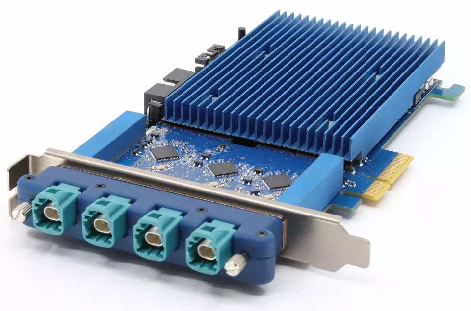

# FG4 frame grabber cards



Digiteq Automotive FrameGrabber 4 (FG4) is a PCIe card capable of capturing and
generating FPD-Link III and GMSL2/3 video streams as used in the automotive
industry.

The card has support for the Linux and Windows operating systems.

## Linux

On Linux a standard v4l2 interface is used to access the card. FG4-specific
settings are configured using _sysfs_. A FG4 card driver called `mgb4` is part
of Linux starting with version 6.7 of the kernel.

### Configuration

Several FG4-specific aspects may/must be configured in _sysfs_ to get/provide
the desired FPD-Link/GMSL2 streams. The whole configuration interface is
documented in the [admin-guide/media/mgb4.html](https://docs.kernel.org/admin-guide/media/mgb4.html)
section of the Linux kernel's documentation.

To change any of the parameters simply write into the appropriate _sysfs_ files:

```console
$ echo 0 > /sys/class/video4linux/video0/color_mapping
```

As usual in Linux, permanent _sysfs_ configuration must be provided externaly
using a _UDEV_ configuration. See the [98-mgb4.rules](examples/UDEV/98-mgb4.rules) file
for some example configuration. Usually you only have to configure the
outputs[^1], the inputs are properly autodetected from the video streams.

[^1]: There is no (reliable working) EDID-like mechanism in FPD-Link/GMSL2.

### API documentation

Everything except the FG4-specific configuration described above is controlled
using a standard [v4l2 API](https://docs.kernel.org/userspace-api/media/v4l/v4l2.html).

### Sample applications

For a complex sample application see [DQ Viewer](https://github.com/digiteqautomotive/dqview),
a simple libVLC-based media player that is capable of configuring FG4 devices,
play the v4l2 camera streams as well as produce v4l2 video outputs sourced by
standard H264/MPEG videos.

Additionaly two simple examples how to use the FG4 cards from Python using
OpenCV are provided here. The first (`cam.py`) is a very basic media player.
The second one (`io.py`) is a more advanced example of streaming a video stream
grabbed on input to an output while drawing a text overlay over it.
